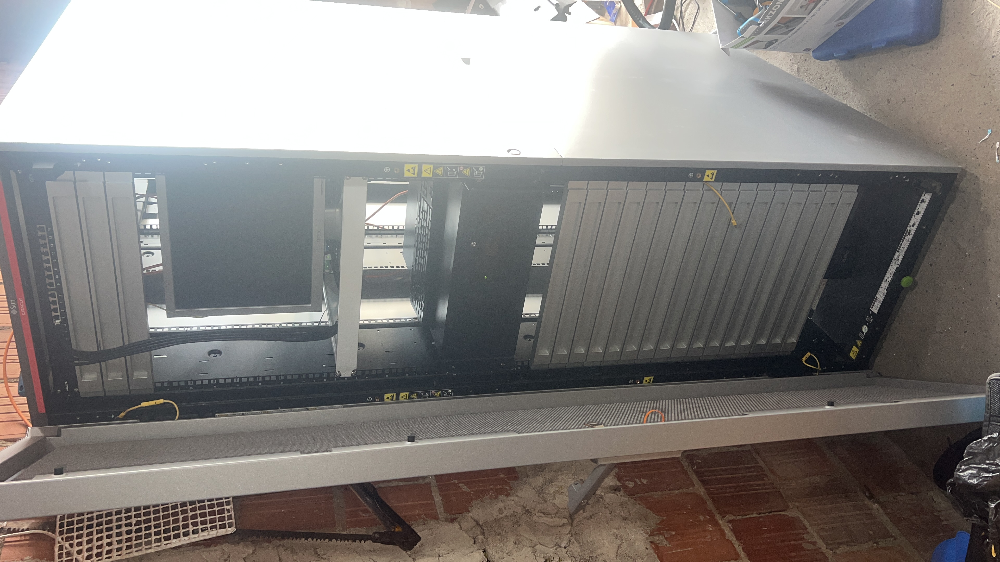

<h1 align="center">HOMELAB</h1>

  Dokumentation einer selbst aufgebauten Homelab-Umgebung mit Fokus auf Infrastruktur, Services, Segmentierung und Betrieb.

  
  
  
  

<strong>WICHTIG:</strong>  
Es ist ein Work in Progress, es fehlen noch viele Sachen zu meinem Homelab, ebenfalls viele interne doku elemente die ich aus sicherheits Gründen nicht veröffentlichen kann.

## 📑 Projektübersicht

Dieses Projekt dokumentiert den Aufbau und Betrieb meines eigenen, standortübergreifenden Homelabs. Ziel ist es nicht nur, einzelne Dienste zu hosten, sondern eine belastbare, zusammenhängende Systemlandschaft zu schaffen. Die Umgebung dient als praxisnahe Plattform für Infrastruktur-Design, Virtualisierung, Netzwerktechnik, Administration und strukturierte Fehleranalyse.

Hier werden reale Betriebsaufgaben wie automatisiertes Deployment, Netzwerksegmentierung, Absicherung, Backup-Strategien und das Management von Service-Abhängigkeiten unter professionellen Bedingungen umgesetzt.

### 🌐 Die Architektur im Überblick

Das Kernmerkmal dieses Setups ist eine **verteilte Architektur über zwei Länder**:

- **Standort Serbien:** Ein leistungsstarker Hauptserver im 24/7-Dauerbetrieb für die primären Dienste und Workloads.
- **Standort Deutschland:** Ein lokales Setup für die tägliche Verwaltung, Entwicklung und den sicheren Zugriff.

### 🛠️ Technisches Fundament

- **Virtualisierung:** Proxmox VE als solide Basis für Container (LXC) und VMs.
- **Standortvernetzung:** Sichere und performante Site-to-Site-Kopplung über WireGuard.
- **Storage:** Klar definierte und getrennte Storage-Rollen für Datenintegrität und Backups.

> **Der Anspruch dieses Projekts:** Diese Dokumentation dient als Nachweis dafür, dass hier keine vorgefertigten Tutorials blind nachgebaut wurden. Stattdessen zeigt sie das tiefere Verständnis für das Design, die Administration und die fortlaufende Pflege einer eigenständig betriebenen Enterprise-Infrastruktur im Kleinformat.

## Kapitel

| #   | Kapitel                                                  | Inhalt                                           |
| --- | -------------------------------------------------------- | ------------------------------------------------ |
| 01  | [Infrastruktur](./docs/01-infrastruktur/1-Overview.md)   | Hardware beider Standorte, Storage, Systemrollen |
| 02  | [Netzwerk](./docs/02-network/overview.md)                | Topologie, WireGuard VPN, Firewall, DNS, WLAN    |
| 03  | [Virtualisierung](./docs/03-virtualisierung/overview.md) | Proxmox VE, VMs, LXC-Container, Deployment       |
| 04  | [Dienste](./docs/04-dienste/overview.md)                 | Core-Infrastruktur, Self-Hosted Apps             |
| 05  | [Operations](./docs/05-operations/overview.md)           | Backup-Strategie, Monitoring, Roadmap            |

## 🎞️ Vorschau

<table style="width:100%; border-collapse: collapse; margin-top: 15px;">
  <tr>
    <td align="center" valign="top" style="width: 33.33%; padding: 10px;">
      
        
      <strong>📦 1. Netzwerkschrank</strong>
       
      <small style="color: #666;">Sun Oracle 19" Rack-Ansicht</small>
    </td>
    <td align="center" valign="top" style="width: 33.33%; padding: 10px;">
      
        
      <strong>🖥️ 2. Server-Chassis</strong>
       
      <small style="color: #666;">4 HE Gehäuse mit Hot-Swap</small>
    </td>
    <td align="center" valign="top" style="width: 33.33%; padding: 10px;">
      
        
      <strong></strong>
       
      <small style="color: #666;"></small>
    </td>
  </tr>
</table>
