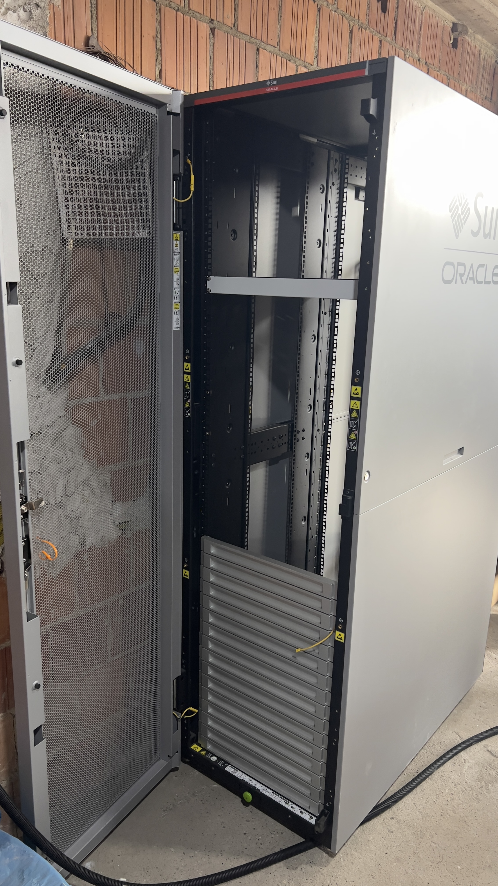
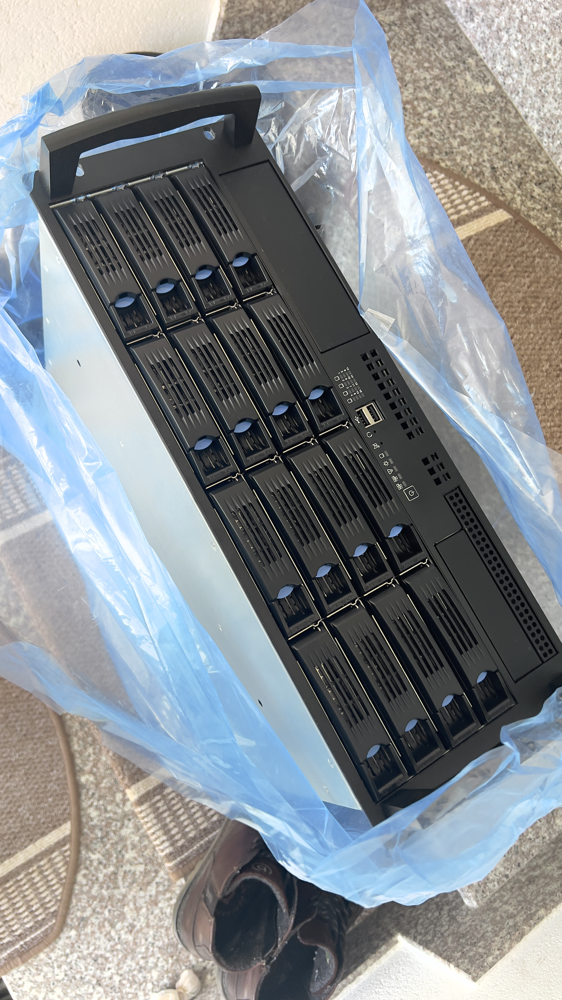

<h1 align="center">💻 1.1 Housing (Das Zuhause der Hardware)</h1>

  Am Standort 🇷🇸 Serbien wird die ganze Infrastruktur in einer professionellen Rack-Umgebung, Gehäuse-Strukturen und Stromabsicherung.

  <a href="../../README.md">🏠 Hauptmenü</a> / <a href="./01-Overview.md">📂 01-Infrastruktur</a> / 1.1-Housing</a>

## 🌐 Physische Rack-Infrastruktur

Die zentrale Hardware am großen RZ in Serbien, ist in einer professionellen Rack-Umgebung untergebracht, um optimale Kühlung, physischen Schutz und Enterprise-Wartbarkeit zu gewährleisten.

| Infrastruktur-Typ | Beschreibunf & Modell                                        | Dimensionen / Belegung |
| :---------------: | :----------------------------------------------------------- | ---------------------- |
|  Netzwerkschrank  | Sun Oracle 19" Serverrack                                    | Zentrales Housing      |
|  Server-Chassis   | Professionelles 19-Zoll Servergehäuse mit Hot-Swap-Backplane | 4 HE (Höheneinheiten)  |
| Stromabsicherung  | APC Back-UPS (Unterbrechungsfreie Stromversorgung)           | Physische Rack-Basis   |

## 📸 Hardware-Komponenten & Galerie

Visuelle Dokumentation der verbauten Housing- und Schutz-Komponenten im Rack.

<table style="width:100%; border-collapse: collapse; margin-top: 15px;">
  <tr>
    <td align="center" valign="top" style="width: 33.33%; padding: 10px;">
      
        
      <strong>📦 1. Netzwerkschrank</strong>
       
      <small style="color: #666;">Sun Oracle 19" Rack-Ansicht</small>
    </td>
    <td align="center" valign="top" style="width: 33.33%; padding: 10px;">
      
        
      <strong>🖥️ 2. Server-Chassis</strong>
       
      <small style="color: #666;">4 HE Gehäuse mit Hot-Swap</small>
    </td>
    <td align="center" valign="top" style="width: 33.33%; padding: 10px;">
      
        
      <strong>⚡ 3. Stromabsicherung</strong>
       
      <small style="color: #666;">APC Unterbrechungsfreie Stromversorgung</small>
    </td>
  </tr>
</table>

  Nächstes Unterkapitel: <a href="./1.2-Server_Hardware.md">🖥️ 1.2 Rechenknoten (Server-Hardware)</a>

