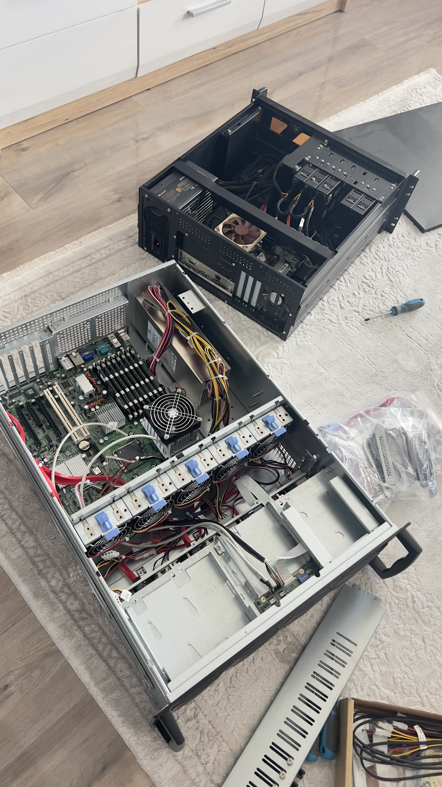

<h1 align="center">💻 1.2 Rechenknoten (Server-Hardware)</h1>

  Detaillierte technische Spezifikationen der Virtualisierungs-Hosts und Management-Nodes.

  <a href="../../README.md">🏠 Hauptmenü</a> / <a href="./01-Overview.md">📂 01-Infrastruktur</a> / 1.2-Server_Hardware

## Übersicht aller Server

<table style="width:100%; border-collapse: collapse; margin-top: 20px;">
  <thead>
    <tr style="border-bottom: 2px solid #555;">
      <th align="left" style="padding: 10px; width: 25%;">Standort</th>
      <th align="left" style="padding: 10px; width: 25%;">Node</th>
      <th align="left" style="padding: 10px; width: 50%;">Technische Spezifikation & Rolle</th>
    </tr>
  </thead>
  <tbody>
    <tr style="border-bottom: 1px solid #ddd;">
      <td rowspan="1" valign="top" style="padding: 12px 10px;"><strong>🇷🇸 Serbien</strong></td>
      <td style="padding: 12px 10px;">Node 1: Core Server</td>
      <td style="padding: 12px 10px;">Proxmox-Core-Node für zentrale Virtualisierung und flexible Infrastruktur-Rollen</td>
    </tr>
    <tr style="border-bottom: 1px solid #ddd;">
      <td rowspan="2" valign="top" style="padding: 12px 10px;"><strong>🇩🇪 Deutschland</strong></td>
      <td style="padding: 12px 10px;">Node 1: Main Control / Bastion Server</td>
      <td style="padding: 12px 10px;">Energieeffizienter 24/7-Node für Monitoring, zentrale Dienste und administrativen Zugriff</td>
    </tr>
    <tr>
      <td style="padding: 12px 10px;">Node 2: Entwicklungs / Testing</td>
      <td style="padding: 12px 10px;">On-Demand-Server für Entwicklung, Tests, Experimente und temporäre Workloads</td>
    </tr>
  </tbody>
</table>

## 🇷🇸 Server in Serbien

<h3>Node 1: Core Node</h3>

<table style="width:100%; border-collapse: collapse; margin-top: 15px;">
  <tr>
    <td width="60%" valign="top" style="padding-right: 20px;">
      <table style="width:100%; border-collapse: collapse;">
        <tr style="border-bottom: 2px solid #555;">
          <th align="left" style="padding: 10px;">Komponente</th>
          <th align="left" style="padding: 10px;">Spezifikation</th>
        </tr>
        <tr style="border-bottom: 1px solid #444;">
          <td style="padding: 10px;">CPU</td>
          <td style="padding: 10px;">Intel Core i7-11600, 6 Kerne / 12 Threads</td>
        </tr>
        <tr style="border-bottom: 1px solid #444;">
          <td style="padding: 10px;">RAM</td>
          <td style="padding: 10px;">32 GB DDR4</td>
        </tr>
        <tr style="border-bottom: 1px solid #444;">
          <td style="padding: 10px;">Gehäuse</td>
          <td style="padding: 10px;">Chenbro Servergehäuse mit Hot-Swap-Unterstützung</td>
        </tr>
        <tr style="border-bottom: 1px solid #444;">
          <td style="padding: 10px;">Speicher</td>
          <td style="padding: 10px;">4 × 1 TB</td>
        </tr>
        <tr>
          <td style="padding: 10px;">Rolle</td>
          <td style="padding: 10px;">Core Node für zentrale Virtualisierung und zukünftige Infrastruktur-Dienste</td>
        </tr>
      </table>
      

        Der Core Node in Serbien bildet die zentrale Hardware-Basis dieser Infrastruktur.
        Das System ist als Virtualisierungs-Host vorgesehen und dient als flexible Plattform
        für spätere Dienste, virtuelle Maschinen und Erweiterungen.
      

      

        Durch das Hot-Swap-fähige Servergehäuse und die getrennte Speicherbestückung ist der
        Node wartungsfreundlich aufgebaut und besser für einen dauerhaften Infrastruktur-Betrieb geeignet
        als ein klassisches Desktop-System.
      

    </td>
    <td width="40%" align="center" valign="top">
      
        
      <strong>🇷🇸 Node 1: Core Node</strong> 
      <small>Server-Hardware mit Hot-Swap-Gehäuse als zentrale Virtualisierungsbasis</small>
    </td>
  </tr>
</table>

## 🇩🇪 Server in Deutschland

<h3>Node 1: Main Control / Bastion Server</h3>

<table style="width:100%; border-collapse: collapse; margin-top: 15px;">
  <tr>
    <td width="60%" valign="top" style="padding-right: 20px;">
      <table style="width:100%; border-collapse: collapse;">
        <tr style="border-bottom: 2px solid #555;">
          <th align="left" style="padding: 10px;">Komponente</th>
          <th align="left" style="padding: 10px;">Spezifikation</th>
        </tr>
        <tr style="border-bottom: 1px solid #444;">
          <td style="padding: 10px;">CPU</td>
          <td style="padding: 10px;"><!-- z.B. Intel Core i5-8500T, 6 Kerne / 6 Threads → bitte ergänzen --></td>
        </tr>
        <tr style="border-bottom: 1px solid #444;">
          <td style="padding: 10px;">RAM</td>
          <td style="padding: 10px;"><!-- z.B. 16 GB DDR4 → bitte ergänzen --></td>
        </tr>
        <tr style="border-bottom: 1px solid #444;">
          <td style="padding: 10px;">Gehäuse</td>
          <td style="padding: 10px;">Lenovo ThinkCentre Tiny (Compact Form Factor)</td>
        </tr>
        <tr style="border-bottom: 1px solid #444;">
          <td style="padding: 10px;">Speicher</td>
          <td style="padding: 10px;"><!-- z.B. 1 × 256 GB SSD → bitte ergänzen --></td>
        </tr>
        <tr>
          <td style="padding: 10px;">Rolle</td>
          <td style="padding: 10px;">Main Control / Bastion Server – Monitoring, Verwaltung & administrativer Zugriff</td>
        </tr>
      </table>
      

        Der Main Control / Bastion Server ist der dauerhaft betriebene Verwaltungs-Node am Standort Deutschland.
        Er dient als stabiler Zugangspunkt zur Infrastruktur und übernimmt zentrale Kontroll- und Basisfunktionen.
      

      

        Durch den kompakten Formfaktor und den geringen Energieverbrauch eignet sich der Lenovo ThinkCentre Tiny
        besonders für Aufgaben, die dauerhaft verfügbar sein sollen, ohne unnötig viel Strom zu verbrauchen.
      

    </td>
    <td width="40%" align="center" valign="top">
      
        
      <strong>🇩🇪 Node 1: Main Control / Bastion Server</strong> 
      <small>24/7-Node für Verwaltung, Monitoring und kontrollierten Infrastruktur-Zugriff</small>
    </td>
  </tr>
</table>

<h3>Node 2: Entwicklung / Testing</h3>

<table style="width:100%; border-collapse: collapse; margin-top: 15px;">
  <tr>
    <td width="60%" valign="top" style="padding-right: 20px;">
      <table style="width:100%; border-collapse: collapse;">
        <tr style="border-bottom: 2px solid #555;">
          <th align="left" style="padding: 10px;">Komponente</th>
          <th align="left" style="padding: 10px;">Spezifikation</th>
        </tr>
        <tr style="border-bottom: 1px solid #444;">
          <td style="padding: 10px;">CPU</td>
          <td style="padding: 10px;"><!-- z.B. AMD Ryzen 5 5600X, 6 Kerne / 12 Threads → bitte ergänzen --></td>
        </tr>
        <tr style="border-bottom: 1px solid #444;">
          <td style="padding: 10px;">RAM</td>
          <td style="padding: 10px;"><!-- z.B. 32 GB DDR4 → bitte ergänzen --></td>
        </tr>
        <tr style="border-bottom: 1px solid #444;">
          <td style="padding: 10px;">Gehäuse</td>
          <td style="padding: 10px;">Selbst gebauter Rechner (Tower / ATX)</td>
        </tr>
        <tr style="border-bottom: 1px solid #444;">
          <td style="padding: 10px;">Speicher</td>
          <td style="padding: 10px;"><!-- z.B. 1 × 1 TB SSD + 1 × 2 TB HDD → bitte ergänzen --></td>
        </tr>
        <tr>
          <td style="padding: 10px;">Rolle</td>
          <td style="padding: 10px;">On-Demand-Node für Entwicklung, Tests, Experimente und temporäre Workloads</td>
        </tr>
      </table>
      

        Der Entwicklungs- und Testing-Node wird nicht dauerhaft betrieben, sondern bei Bedarf eingeschaltet.
        Er dient als flexible Umgebung für Tests, Experimente und technische Weiterentwicklung.
      

      

        Durch die Trennung vom 24/7-Control-Node bleiben wichtige Basisdienste stabil,
        während neue Konfigurationen oder Systeme kontrolliert ausprobiert werden können.
      

    </td>
    <td width="40%" align="center" valign="top">
      
        
      <strong>🇩🇪 Node 2: Entwicklung / Testing</strong> 
      <small>On-Demand-System für Tests, Entwicklung und temporäre Workloads</small>
    </td>
  </tr>
</table>
