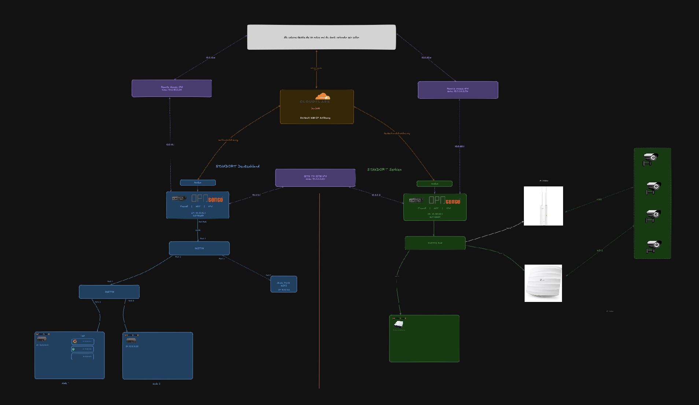

<h1 align="center">💻 Kapitel 2: Netzwerk</h1>

  <a href="../../README.md">🏠 Hauptmenü</a> / <b>02-Network</b>

  

## 🌐 Kapitel Übersicht

Dieses Kapitel dokumentiert die gesamte Netzwerkinfrastruktur des Homelabs. Da die Ressourcen physisch auf zwei Standorte verteilt sind, liegt der Fokus auf der standortübergreifenden Vernetzung, der sicheren Tunnelkommunikation und der logischen Netztrennung.

## Inhalt dieses Kapitels

| #   | Datei                                                       | Inhalt                                             |
| --- | ----------------------------------------------------------- | -------------------------------------------------- |
| 2.1 | [`2.1-Deutschland`](./2.1-Deutschland.md)                   | LAN DE — Topologie, Geräte & Proxmox-Nodes         |
| 2.2 | [`2.2-Serbien`](./2.2-Serbien.md)                           | LAN RS — Topologie, Switch, Access Points & Server |
| 2.3 | [`2.3-Firewall-OPNsense`](./2.3-Firewall-OPNsense.md)       | OPNsense — Zonen, NAT-Konzept & Regelstruktur      |
| 2.4 | [`2.4-VPN-Standortkopplung`](./2.4-VPN-Standortkopplung.md) | VPN-Konzept — Site-to-Site & Remote Access         |

## 🔍 Netzwerk-Matrix auf einen Blick

<table style="width:100%; border-collapse: collapse; margin-top: 15px;">
  <thead>
    <tr style="border-bottom: 2px solid #555;">
      <th align="left" style="padding: 8px;">Standort</th>
      <th align="left" style="padding: 8px;">Netz-Typ</th>
      <th align="left" style="padding: 8px;">Zweck</th>
      <th align="left" style="padding: 8px;">Subnetz</th>
    </tr>
  </thead>
  <tbody>
    <tr style="border-bottom: 1px solid #ddd;">
      <td style="padding: 8px;"><strong>🇩🇪 Deutschland</strong></td>
      <td style="padding: 8px;">LAN</td>
      <td style="padding: 8px;">Lokales Netz – Nodes, Switches & Endgeräte</td>
      <td style="padding: 8px;"><code><!-- TODO: Subnetz ergänzen --></code></td>
    </tr>
    <tr style="border-bottom: 1px solid #ddd;">
      <td style="padding: 8px;"><strong>🇷🇸 Serbien</strong></td>
      <td style="padding: 8px;">LAN</td>
      <td style="padding: 8px;">Lokales Netz – Proxmox, Switch & Access Points</td>
      <td style="padding: 8px;"><code><!-- TODO: Subnetz ergänzen --></code></td>
    </tr>
    <tr style="border-bottom: 1px solid #ddd;">
      <td style="padding: 8px;"><strong>🇩🇪 ↔ 🇷🇸</strong></td>
      <td style="padding: 8px;">Site-to-Site VPN</td>
      <td style="padding: 8px;">Verschlüsselter Tunnel zwischen beiden Standorten</td>
      <td style="padding: 8px;"><code><!-- TODO: Subnetz ergänzen --></code></td>
    </tr>
    <tr style="border-bottom: 1px solid #ddd;">
      <td style="padding: 8px;"><strong>🇩🇪 Deutschland</strong></td>
      <td style="padding: 8px;">Remote Access VPN</td>
      <td style="padding: 8px;">VPN-Pool für externe Clients → DE</td>
      <td style="padding: 8px;"><code><!-- TODO: Subnetz ergänzen --></code></td>
    </tr>
    <tr>
      <td style="padding: 8px;"><strong>🇷🇸 Serbien</strong></td>
      <td style="padding: 8px;">Remote Access VPN</td>
      <td style="padding: 8px;">VPN-Pool für externe Clients → RS</td>
      <td style="padding: 8px;"><code><!-- TODO: Subnetz ergänzen --></code></td>
    </tr>
  </tbody>
</table>
