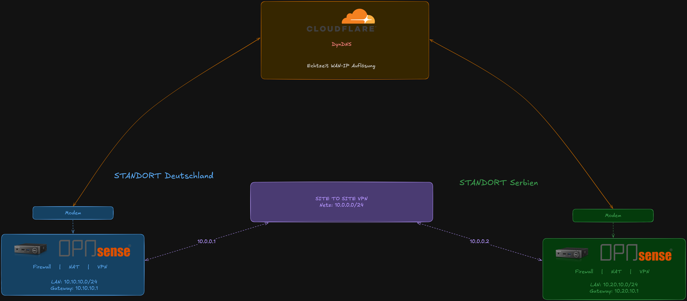

<h1 align="center">🔐 2.4 — VPN Konzept</h1>

  Konzept und Aufbau der verschlüsselten Verbindungen zwischen beiden Standorten und für externe Clients.

  <a href="../../README.md">🏠 Hauptmenü</a> / <a href="./2-Overview.md">02-Network</a> / 2.4-VPN_Konzept

## Übersicht

Die Standortkopplung erfolgt vollständig über verschlüsselte VPN-Tunnel, realisiert mit **WireGuard** auf beiden OPNsense-Firewalls. Es gibt zwei voneinander unabhängige VPN-Konzepte:

| Typ                   | Zweck                                    | Endpunkte                            |
| --------------------- | ---------------------------------------- | ------------------------------------ |
| **Site-to-Site VPN**  | Permanente Verbindung zwischen DE und RS | OPNsense DE ↔ OPNsense RS            |
| **Remote Access VPN** | Externer Zugriff für Clients             | Externe Geräte → OPNsense DE oder RS |

## Site-to-Site VPN

### Konzept

Der Site-to-Site-Tunnel verbindet beide Standorte dauerhaft miteinander. Beide Seiten können darüber auf Ressourcen des jeweils anderen Standorts zugreifen, als wären sie im selben lokalen Netz.

### Logischer Aufbau

  

### Eigenschaften

| Eigenschaft        | Wert                                                             |
| ------------------ | ---------------------------------------------------------------- |
| **Protokoll**      | WireGuard                                                        |
| **Tunnel-Subnetz** | 10.0.0.0/24                                                      |
| **Initiator**      | Standort Deutschland                                             |
| **DynDNS**         | Beide Seiten nutzen dynamische DNS-Auflösung für WAN-IP-Tracking |
| **Status**         | ✅ Produktivbetrieb                                              |

## Remote Access VPN

### Konzept

Externe Clients (z.B. Mobilgeräte, Laptops) können sich per WireGuard mit einem der beiden Standorte verbinden und erhalten Zugriff auf die jeweilige Infrastruktur.

### Logischer Aufbau

  

### Eigenschaften

| Eigenschaft           | Wert                            |
| --------------------- | ------------------------------- |
| **Protokoll**         | WireGuard                       |
| **VPN-Pool DE**       | 10.0.10.0/24                    |
| **VPN-Pool RS**       | 10.0.20.0/24                    |
| **Authentifizierung** | Public-Key (WireGuard-Standard) |
| **Status**            | ✅ Produktivbetrieb             |

## DynDNS — WAN-IP-Tracking

Da beide Standorte über dynamische WAN-IPs verfügen, wird die jeweils aktuelle IP über einen DynDNS-Dienst aufgelöst. Beide OPNsense-Instanzen aktualisieren ihren DNS-Eintrag automatisch bei IP-Wechsel.

| Standort       | DynDNS-Eintrag                                    |
| -------------- | ------------------------------------------------- |
| 🇩🇪 Deutschland | `<!-- intern – nicht öffentlich dokumentiert -->` |
| 🇷🇸 Serbien     | `<!-- intern – nicht öffentlich dokumentiert -->` |

> Die konkreten Hostnamen sind aus Sicherheitsgründen nicht Teil dieser öffentlichen Dokumentation.

